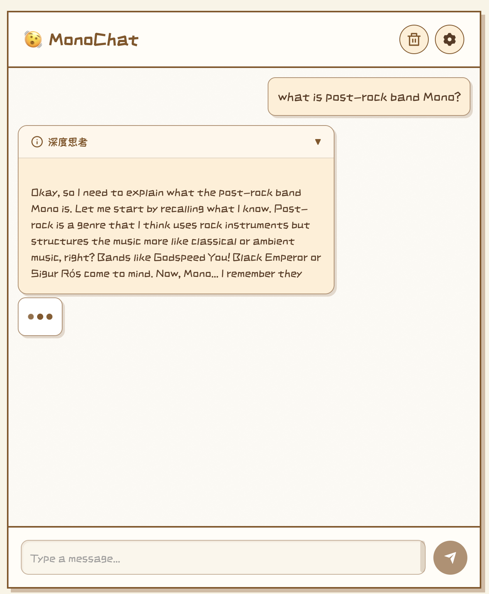

# MonoChat

MonoChat is a minimalist yet powerful Large Language Model chatbot application designed for learning and experimentation purposes. It provides a friendly interface that allows you to converse with various advanced language models.

## Features

- 🚀 Support for multiple LLMs (DeepSeek, Qwen3, GLM4, etc.)
- 💬 Streaming responses with real-time AI replies
- 🧠 Thinking process visualization to understand model reasoning
- 🔄 Context retention for multi-turn conversations
- 🛠️ Clean and intuitive user interface
- 📦 Separate frontend and backend architecture for easy extension
- 🔒 Secure API key management through environment variables

## Application Preview

Below is a preview of the MonoChat interface:



## Coming Soon

- support DeepSearch (via [MonoSearch](https://github.com/halcyonway/MonoSearch))

## Installation Guide

### Prerequisites

- Python 3.8+
- Node.js 14+
- [uv](https://github.com/astral-sh/uv) package manager
- SiliconFlow API key (register at [SiliconFlow](https://www.siliconflow.cn/))

### macOS/Linux Installation

1. Clone the repository

```bash
git clone https://github.com/yourusername/MonoChat.git
cd MonoChat
```

2. Set your API key as an environment variable

```bash
export SILICON_FLOW_API_KEY=your_api_key_here
```

3. One-click startup (recommended)

```bash
chmod +x start.sh
./start.sh
```

This will automatically install all dependencies and start the application.

### Manual Installation

1. Install backend dependencies

```bash
uv venv
uv pip install -e .
```

2. Install frontend dependencies

```bash
cd client
npm install
cd ..
```

3. Start the backend server

```bash
SILICON_FLOW_API_KEY=your_api_key_here uv run src/api/main.py
```

4. Start the frontend (in a new terminal)

```bash
cd client
npm start
```

5. Open your browser and visit `http://localhost:3000`

## Usage

1. Select the language model you want to use
2. Enter your question or prompt
3. Send and watch the real-time response
4. Explore the thinking process to understand model reasoning

## Changelog

### v0.1.0 (Initial Release)

- Basic chat functionality
- Support for multiple LLM models
- Streaming responses and thinking process visualization
- Frontend/backend architecture setup

## License

[MIT License](LICENSE)